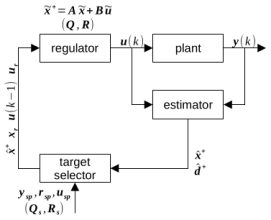
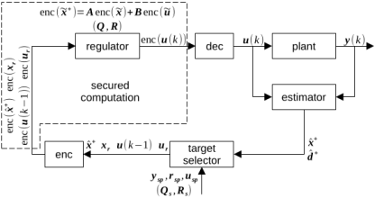

# HECTR

(Leveled) **H**omomorphic **E**ncrypted (Model Predictive) **C**on**TR**oller

## Abstract

RLWE-based homomorphic encryption (HE) is a post-quantum secure advanced cryptographic technique to perform arith- metic operations over ciphertext, which can be used to enhance the security of the cyber-physical system (CPS). In the secure enhanced scheme, the CPS performs arithmetic operations over the encrypted signals without decrypting, so that the signal leakage risk is avoided. In this project, the CKKS HE scheme is used to develop an encrypted model predictive controller (MPC). The correctness of the encrypted MPC compared with the unencrypted settings is verified via a CSTR model.

## Design

The unencrypted settings:



The encrypted settings:



## How to use

```sh
# step 1: get HECTR and build
git clone https://github.com/OChicken/HECTR.git
cd HECTR
git submodule init
git submodule update
mkdir -p lib
make

# step 2: run tests
cd tests
LD_LIBRARY_PATH=$PWD/../lib:$LD_LIBRARY_PATH
make test-hectr
./test-hectr cstr-mpc
./test-hectr cstr-hempc
```
